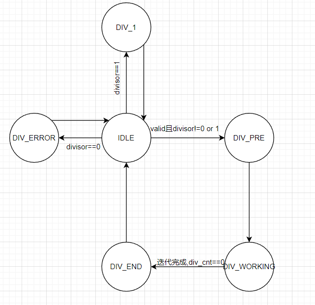

# SRT-Divider

## 简介
    本文适用人群:已经知道什么是恢复除法和非恢复除法,且想实现SRT除法,但网上资料各异,不知道选择什么。
SRT除法属于non-restoring除法的一种,我们正常使用算式计算除法是一位一位的得到商值,但实际上我们可以一次计算多位,这样就会加速除法,而SRT除法就是通过一次得出多位商来加速除法。
## SRT前置知识
1.https://zhuanlan.zhihu.com/p/397563781  
知乎的这篇文章将SRT需要知道的前置知识总结了一下,不过大概率看不懂,没关系,还有一个链接  
2.https://zhuanlan.zhihu.com/p/550913605  
这个链接主要讲解了SRT除法的实现,如果仅仅想实现SRT除法,强推这个链接 
如果真的想读懂SRT,建议搜索A New Class of Digital Division Methods,这篇论文是SRT算法的源论文之一,另一篇全是数学推导
## 实现细节
主要有四个模块:QDS表,找1模块,on-the-fly conversion和DIV状态机
### QDS 表
见链接2或3,选择任意一个实现即可
### 找1模块
网上很多资料了,本人采用的one hot码实现
### on-the-fly
在看完上面两个链接后,你可能觉得还是不太懂,并且也没说on-the-fly怎么实现 
3.https://www.cnblogs.com/devindd/articles/17633558.html 
这个链接列出了on-the-fly的实现公式,并且给出了SRT4除法的QDS表一种选择方法 
我自己是按照第二个链接给的QDS表实现的,在实现中,发现-2,-1,0,1,2的边界商的取值也不能乱选(可以看看当选择的table为15时,有一部分范围会重叠),对于这些部分,其可供选择的商就有两个,比如部分余数的前六位为-4,这时候既可以选择1,也可以选择0,但我建议选择1,有时候选择0会导致之后的步骤部分余数前六位超出QDS表的范围(实现中在高位商遇到该问题,选择0导致输出最大也达不到正确的值)
### DIV状态机  

 

图上未标出转换条件即为下周期就跳转状态,下面介绍每个状态的含义  
**IDLE**:DIV初始状态,等待valid信号输入  
**DIV_1**:除数为1,这时有些table商选择范围会超出QDS表,导致计算出错,故单独列一个状态计算除数为1的情况  
**DIV_ERROR**:除数为0,拉高error信号  
**DIV_PRE**:寄存除数被除数,得出到底该使用QDS表的哪个table
**DIV_WORKING**:除法器运行状态,当div_cnt为0时结束运行,div_cnt的初始值即为迭代次数,对于SRT4来说,迭代次数为位宽的1/2  
**DIV_END**:对得到的商和余数做后处理,查看余数正负性,生成ready信号  
## 仿真
先生成正确的商和余数,然后等自己的除法器计算完成后进行对比,如果错误则停止仿真。
## 其他参考资料
https://zhuanlan.zhihu.com/p/445439418 
COMPUTER ARITHMETIC Algorithms and Hardware Designs:这本书介绍了许多高级的乘除法算法
Higher-Radix Division Using Estimates of the Divisor and Partial Remainders:对高基SRT算法的分析论文